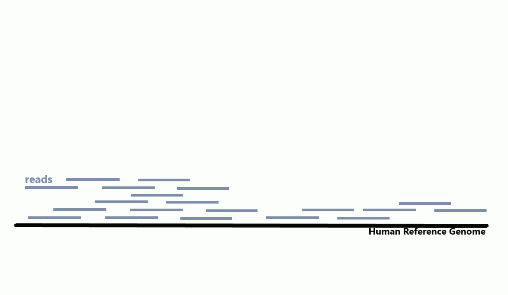

# RUX-RNA-SEQ

This RNA-SEQ pipeline is designed for the computational prediction of transcripts in the genome. All you need is a Galaxy account (it's free and it comes with 200GB!). No coding skills required!

I've collected data from 27 independent studies and focused on 20,500 nt in a "dark" region of a human genome (article coming soon on BioRxiv; stay tuned!). An extensive step-by-step guide will be availabe here shortly. 
